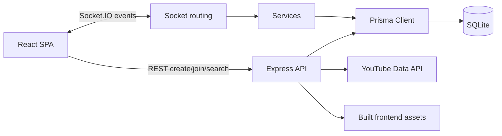
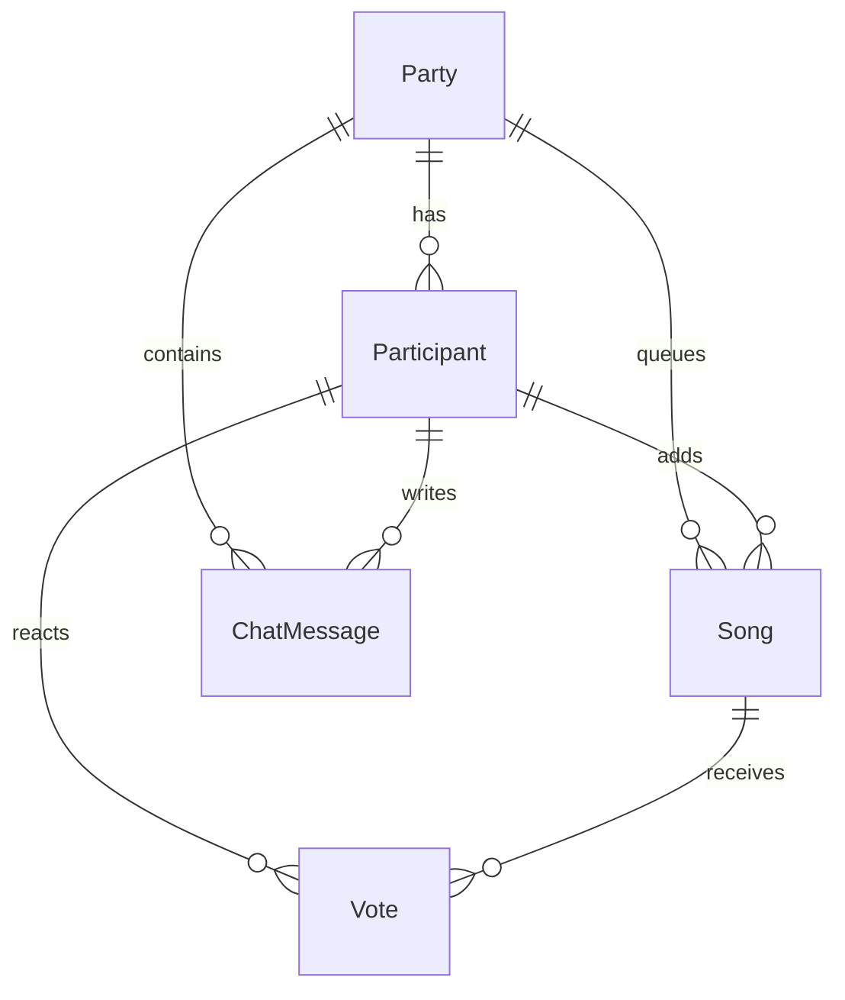

# Architecture

Nero Party is a full-stack realtime music party app. The frontend is a React/Vite single-page app; the backend is an Express server with Socket.IO for live room activity and Prisma for persistence.

## Runtime Boundaries

- `frontend/src/pages` owns route-level user flows: create room, join room, live party, and results.
- `frontend/src/components` owns reusable party UI such as player controls, queue, chat, participants, song search, and leaderboard.
- `frontend/src/stores/partyStore.ts` is the client-side room state cache. It normalizes socket payloads into renderable state and keeps the persistent `clientToken`.
- `frontend/src/lib/socket.ts` owns the singleton Socket.IO client and connection helpers.
- `backend/src/index.ts` wires Express middleware, REST routers, Socket.IO handlers, static frontend serving, health checks, and non-blocking YouTube API validation.
- `backend/src/routing` owns REST endpoints for party setup and YouTube search proxying.
- `backend/src/socket/handlers.ts` is the realtime routing boundary. It registers events, validates high-level payloads, and delegates business work.
- `backend/src/socket/context.ts` centralizes socket participant lookup and host authorization.
- `backend/src/socket/playback.ts` owns playback transitions, party timers, skip/previous/direct-play behavior, and party finalization.
- `backend/src/socket/partyState.ts` builds the initial room snapshot and leaderboard sync payload.
- `backend/src/socket/errors.ts` contains the socket exception boundary for expected `AppError` failures and unexpected logs.
- `backend/src/socket/state.ts` owns process-local live maps for active rooms and socket membership.
- `backend/src/services` contains pure or external-facing business helpers: YouTube search, leaderboard scoring, queue mutations, and text sanitization.
- `backend/src/exceptions` contains typed application errors shared by runtime boundaries.
- `backend/src/models` contains Prisma access and DTO conversion helpers.
- `backend/prisma/schema.prisma` defines the durable data model.
- `shared/types.ts` and `frontend/src/lib/types.ts` define client/server payload contracts. Keep them in sync when events or REST shapes change.

## Data Model

- `Party`: room identity, host token, limits, add mode, status, and creation time.
- `Participant`: display identity, `clientToken`, connection flag, and avatar color.
- `Song`: YouTube metadata, queue position, playback status, and optional `playedAt`.
- `Vote`: one reaction per participant per song via `@@unique([songId, participantId])`.
- `ChatMessage`: user/system messages tied to a party and optionally a participant.

## Backend Module Notes

- `setupSocketHandlers(io)`: registers socket events and keeps the realtime boundary thin.
- `getSocketContext(socket)`: resolves socket ID to participant, room, and persisted party.
- `getHostSocketContext(socket)`: wraps context lookup with host authorization.
- `addSongToQueue(party, participant, payload)`: validates add-song payloads, enforces add mode and per-person limits, stores the song, and creates the system chat message.
- `reorderQueuedSongs(partyId, songIds)`: updates queued song positions in one transaction and returns a fresh song snapshot.
- `emitPartyState(socket, partyCode, participantId, clientToken)`: assembles initial room state using parallel Prisma reads.
- `advanceToNextSong(io, partyCode)`: marks the current song played, emits `song-ended`, selects the next queued song FIFO by `position`, and emits `now-playing`.
- `startPlayback(io, partyCode, song)`: marks a song playing, stores live playback timing in memory, emits `now-playing`, and activates the party timer on first playback.
- `endParty(io, partyCode)`: marks a party ended, clears its timer, builds final results, emits `party-ended`, and removes live room state.
- `buildLeaderboard(partyId)`: calculates reaction scores and breakdowns from persisted votes.
- `buildFinalResults(partyId)`: sorts final leaderboard by score, then queue position.
- `toSongData(song)`: converts Prisma song records into the client-facing song DTO.
- `searchQuery(query)`: proxies YouTube search and filters unsuitable results before returning simplified metadata.
- `sanitize(input)`: strips HTML-like tags before storing user-visible text.

## State Ownership

Durable state belongs in Prisma: parties, participants, songs, votes, and chat. Live-only coordination belongs in `backend/src/socket/state.ts` maps:

- `rooms`: current song, start time, and playback status per party code.
- `socketParticipants`: socket ID to participant/party/client token mapping.
- `kickedParticipants`: party/client token pairs denied from rejoining.
- `partyTimers`: active timeout handles for party duration limits.

Because live maps are process-local, horizontal scaling would require a shared Socket.IO adapter and external live state storage.
