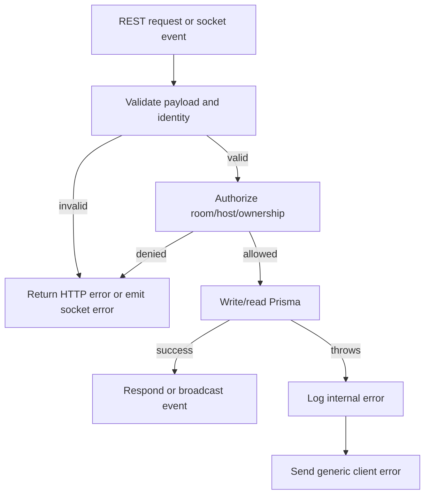

# Error Handling and Testing

## Error-Handling Approach

Nero Party uses explicit boundary validation and user-safe error messages.

- REST routes validate request shape before writes and return HTTP status codes with `{ error }`.
- Socket handlers validate room membership, host authorization, payload shape, party ownership, and limits before writes or broadcasts.
- `backend/src/exceptions/appError.ts` provides typed expected errors.
- `backend/src/socket/errors.ts` wraps every socket event in one exception boundary through `runSocketHandler`.
- Expected user failures emit `error` socket payloads with short messages, such as room full, not in a room, invalid reaction, or host-only control.
- Unexpected backend failures are logged with `console.error` and mapped to generic client messages.
- User-visible text is sanitized before persistence through `sanitize`.
- YouTube integration errors are converted into actionable messages, including missing API key and 403 API-not-enabled cases.
- Startup YouTube API validation is intentionally non-blocking; it warns but does not crash the server.

## Current Test Coverage

- `backend/tests/routing/parties.test.ts`: party creation, add-mode validation, lookup, join, ended-party rejection, and reconnect behavior.
- `backend/tests/services/youtube.test.ts`: `searchSong` behavior for missing API key, fetch errors, and successful responses.
- `backend/tests/services/songQueue.test.ts`: queue add-mode authorization, sanitization, per-person limits, and reorder behavior.
- `backend/tests/app/integration.test.ts`: search proxy behavior, YouTube error mapping, query validation, response shape, and XSS-safe proxy response handling.
- `backend/tests/regression/socket-regressions.test.ts`: data/contract regression coverage for socket payload shape, reaction field naming, `party-state.participantId`, `totalReactions`, and empty queue behavior.

## Testing Strategy

- Unit-test service logic with mocked external dependencies, especially YouTube fetches and leaderboard scoring.
- Route-test REST APIs with `supertest`, asserting status codes, response shape, validation errors, and persisted database state.
- Regression-test socket contracts at the data and payload level whenever fixing frontend/backend mismatches.
- Add integration-style Socket.IO tests for high-risk realtime flows: join, add-song auto-start, host-only controls, kick, reconnect, party end, and queue reorder.
- Keep database cleanup deterministic between tests by deleting dependent rows before parent rows.
- Prefer tests that assert durable outcomes and emitted payload contracts over implementation details of in-memory maps.

## Suggested Test Matrix

| Area | Key cases |
| --- | --- |
| Party REST | create defaults, invalid limits, join full room, join ended room, reconnect with same token |
| Search | missing query, missing API key, YouTube 403, empty results, filtered topic channels |
| Socket join | host direct join, guest direct join, kicked token rejection, room capacity |
| Queue | add limit, host-only add mode, FIFO position, reorder authorization, queue snapshot after reorder |
| Playback | first song activates party, skip advances, empty queue stops playback but keeps party open, selected song play marks previous played |
| Reactions | allowed reaction validation, one reaction per participant/song, leaderboard score updates, final result ordering |
| Chat | empty/long message rejection, sanitized content, system messages for add/kick |
| End party | host-only authorization, timer cleanup, result payload, stats field names |

## Module Descriptions

- `backend/src/routing/parties.ts`: REST lifecycle for create, inspect, and join.
- `backend/src/routing/search.ts`: thin HTTP wrapper around YouTube search service.
- `backend/src/services/youtube.ts`: external API adapter and result normalization.
- `backend/src/services/leaderboard.ts`: reaction score aggregation and final sorting.
- `backend/src/services/songQueue.ts`: queue add validation, add-mode enforcement, song insertion, system messages, and reorder transactions.
- `backend/src/socket/handlers.ts`: realtime event routing and broadcast coordination.
- `backend/src/socket/context.ts`: socket participant context and host authorization.
- `backend/src/socket/playback.ts`: playback state transitions, timers, skip/previous/direct-play controls, and final results emission.
- `backend/src/socket/errors.ts`: expected socket errors and fallback handling for unexpected failures.
- `frontend/src/pages/PartyRoom.tsx`: socket listener registration, event-to-store updates, and room layout.
- `frontend/src/stores/partyStore.ts`: client state transitions and stable song sorting.
- `frontend/src/components/Player.tsx`: playback UI and host controls.
- `frontend/src/components/SongSearch.tsx`: YouTube search UI and `add-song` emission.
