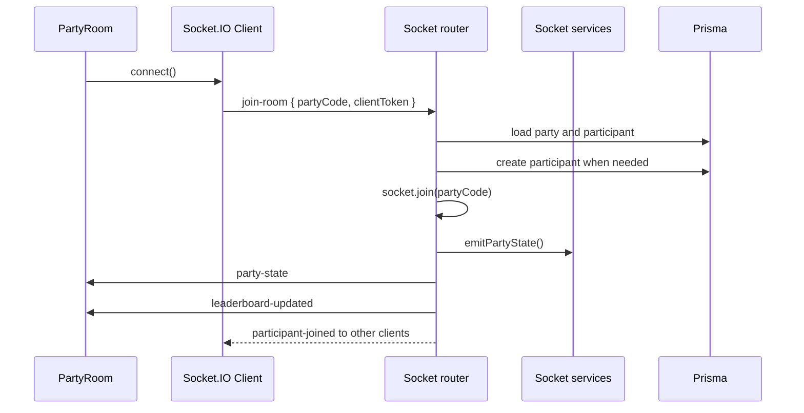
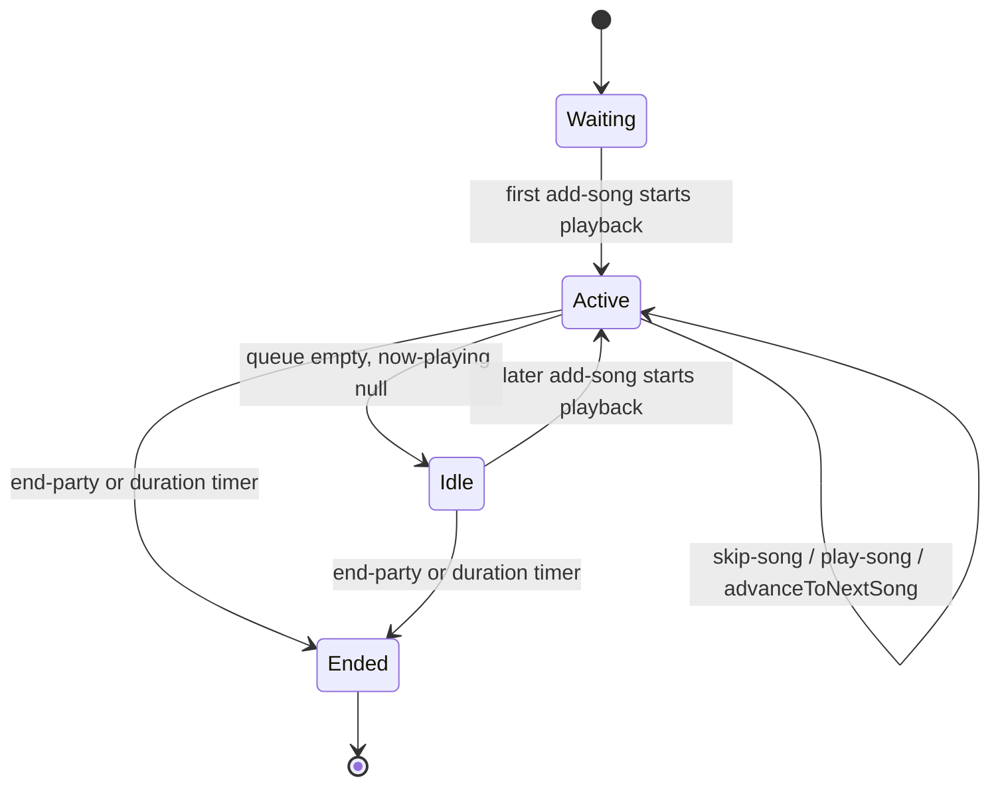

# Realtime and Socket Flow

Socket.IO handles the live party surface after a party is created or joined through REST. The room name is the party code.

## Join and Reconnect

- The browser keeps a `clientToken` in local storage.
- Hosts receive the `hostToken` from `POST /api/parties`; the frontend stores it as the `clientToken`.
- `join-room` looks up an existing participant by `partyId + clientToken`.
- Missing participants are auto-created for host flow and direct room links, subject to room capacity for non-hosts.
- `socketParticipants` maps the transient socket ID back to durable participant identity.

## Core Client-To-Server Events

- `join-room`: enter the party room and receive full `party-state`.
- `add-song`: delegates queue validation and persistence to `addSongToQueue`, broadcasts `song-added`, updates leaderboard, and auto-starts playback if idle.
- `react-to-song`: validate reaction and song ownership, upsert the participant reaction, acknowledge with `reaction-saved`, and broadcast `leaderboard-updated`.
- `chat-message`: validate length, sanitize content, persist chat, and broadcast `chat-message`.
- `reaction`: broadcast a lightweight live emoji burst without persisting it as a song vote.
- `prev-song`, `restart-song`, `seek`, `pause`, `resume`, `skip-song`, `reorder-queue`, `play-song`: host-only playback and queue controls.
- `end-party`: host-only finalization that emits winner, ranked songs, and stats.
- `kick-participant`: host-only removal that marks the participant disconnected, disconnects active sockets, and prevents token rejoin.

## Core Server-To-Client Events

- `party-state`: full room snapshot for initial sync.
- `leaderboard-updated`: current scored leaderboard.
- `song-added`: newly queued song.
- `queue-updated`: complete song list after reorder or direct play.
- `now-playing`: current song and optional `startedAt`.
- `playback-control`: imperative player action such as pause, resume, restart, seek, or stop.
- `song-ended`: previous song payload used by clients to show the reaction prompt.
- `reaction-saved`: acknowledgement that a song reaction was persisted.
- `chat-message`: chat or system message.
- `reaction`: live emoji burst.
- `participant-joined` / `participant-left`: presence deltas.
- `party-ended`: final winner/results/stats payload.
- `kicked`: removal notice before forced disconnect.
- `error`: recoverable validation or operation failure message.

## Playback Flow

Playback behavior lives in `backend/src/socket/playback.ts`. `startPlayback` transitions a waiting party to active and starts the duration timer. `advanceToNextSong` marks the current song played, emits `song-ended`, and either starts the next queued song or emits `stop`/`now-playing` with no song while keeping the party open. `endParty` is the only normal path that marks the party ended and calculates final results.

## Maintainability Notes

- Keep `backend/src/socket/handlers.ts` as routing glue; move reusable socket behavior into `context`, `playback`, `partyState`, `state`, or service modules.
- Keep event payloads stable and document breaking changes in `shared/types.ts` plus `frontend/src/lib/types.ts`.
- Prefer full snapshot events, such as `party-state` and `queue-updated`, after operations that can invalidate client ordering.
- Keep host authorization checks on every host-only event; client-side role checks are only UI affordances.
- Keep all song ordering decisions centralized around `position` and `SONG_STATUS_ORDER`.
